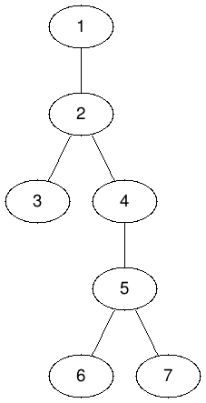

# 대면수업의 고통

## 문제

코로나19의 영향이 점차 약화되면서, 우리 학교는 비대면 수업 대신 대면 수업을 채택하였고 학생들은 2019년처럼 학교 건물을 오가며 수업을 듣고 있다.

하지만 강의실을 오가며 수업을 듣는 것은 꽤나 피곤한 일이다. 출발하는 건물로부터 도착하는 건물까지의 거리가 멀다면 그만큼 오랫동안 걸어야 하기 때문이다. 정현이는 이러한 학생들의 부담을 줄여주기 위해 어느 두 건물을 연결하는 무빙워크를 건설하고 모두가 이용할 수 있도록 하려고 한다.

현재 학교 캠퍼스에는 $N$개의 건물이 있고 두 건물을 양방향으로 잇는 길은 $M$개가 있다. 길을 따라 한 건물에서 이웃한 건물까지 가는데는 $1$분이 소요되고, 어떤 한 쌍의 건물 사이를 오가는 경로는 항상 존재한다.

정현이가 $u$번 건물과 $v$번 건물 사이에 무빙워크를 건설하면 학생들은 이 두 건물 사이를 $1$분만에 오고 갈 수 있게 된다. 이제 정현이는 무빙워크를 건설할 최적의 위치를 선정하기 위해 아래와 같은 고민을 하고 있다.

* 어떤 두 건물 사이에 무빙워크 **하나를** 적절히 건설해서, $a$번 건물에서 $b$번 건물로 $x$분 내에 이동할 수 있게 하면서 **이와 동시에** $c$번 건물에서 $d$번 건물로도 $y$분 내에 이동할 수 있도록 할 수 있을까?

정현이가 건설 자금을 모으느라 고군분투하는 동안, 정현이의 고민들을 대신 해결해주자!

## 입력

첫째 줄에는 건물의 개수 $N$과 두 건물을 잇는 길의 개수 $M$이 공백으로 구분되어 주어진다. $(2 \leq N \leq 1 \,000, N-1 \leq M \leq \min(1\,000, \frac{n(n-1)}{2}))$

둘째 줄부터 $M$개 줄에 걸쳐, 각 줄에 한 길이 연결하는 두 건물의 번호 $u, v$가 공백으로 구분되어 주어진다. 동일한 쌍의 건물을 연결하는 길이 두 번 이상 주어지는 경우는 없다. $(1 \leq u, v \leq N, u \not = v)$

$M+2$번째 줄에 해결해야 할 고민의 수 $Q$개가 주어진다. $(1 \leq Q \leq 2\times 10^5)$

$M+3$번째 줄부터 $Q$개 줄에 걸쳐, 각 줄에 $a$, $b$, $x$, $c$, $d$, $y$가 공백으로 구분되어 주어진다. 이는 $a$번 건물에서 $b$번 건물로 $x$분 내에, $c$번 건물에서 $d$번 건물로 $y$분 내에 이동할 수 있는지에 대한 고민을 나타낸다. $(1\leq a, b, c, d \leq N, 1\leq x, y \leq N-1)$

## 출력

$Q$개 줄에 걸쳐 정현이의 고민에 대한 해답을 출력한다. 조건을 만족하도록 무빙워크를 건설할 수 있다면 `YES`, 그렇지 않다면 `NO`를 출력하라.

## 예제 입력 1

```
7 6
1 2
2 3
2 4
4 5
5 6
5 7
3
1 3 6 6 7 6
1 6 3 3 7 3
1 6 1 3 7 3
```

## 예제 출력 1

```
YES
YES
NO
```

## 힌트



각 고민에 대응되는 결과를 설명하면 아래와 같다.
* 첫 번째 고민의 경우, 무빙워크 없이도 $1$번 건물에서 $3$번 건물까지 2초, $6$번 건물에서 $7$번 건물까지 2초가 소요된다. 따라서 무빙워크를 어떻게 건설하더라도 조건이 만족된다.
* 두 번째 고민의 경우, 무빙워크가 없다면 두 경로 모두 4초가 걸리지만 $2$번 건물과 $5$번 건물 사이에 무빙워크를 건설하면 시간이 단축되어 3초 내에 도달할 수 있게 된다.
* 세 번째 고민의 경우, 무빙워크를 어떻게 건설해도 두 조건을 동시에 만족시킬 수 없다.